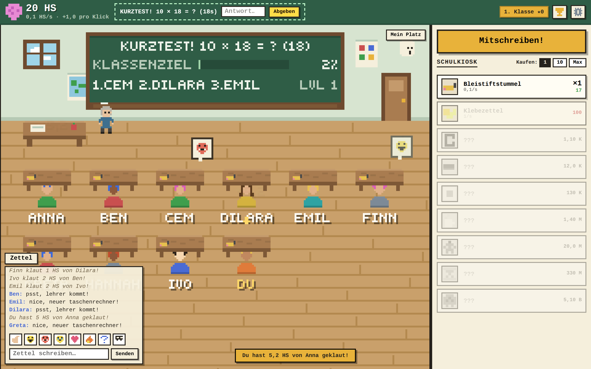
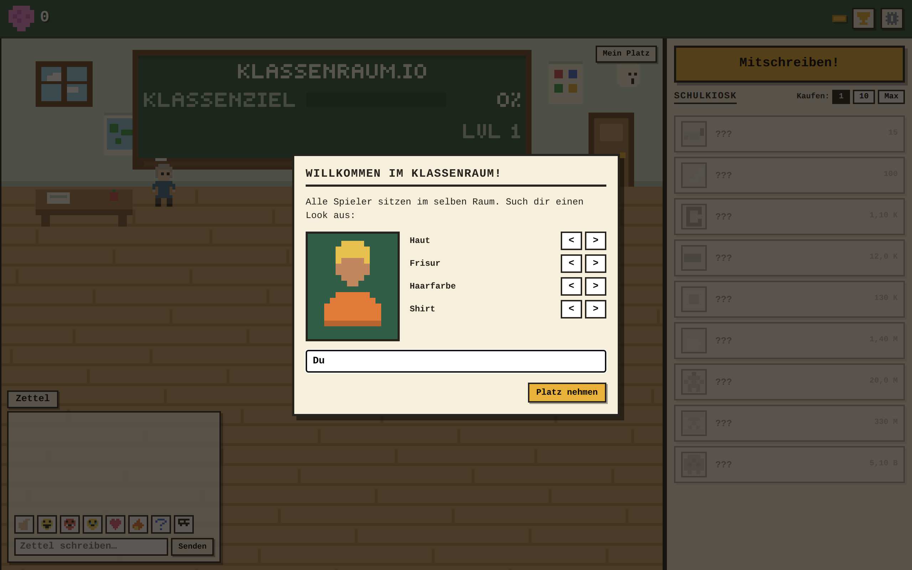
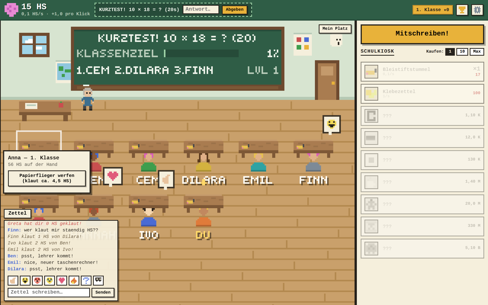
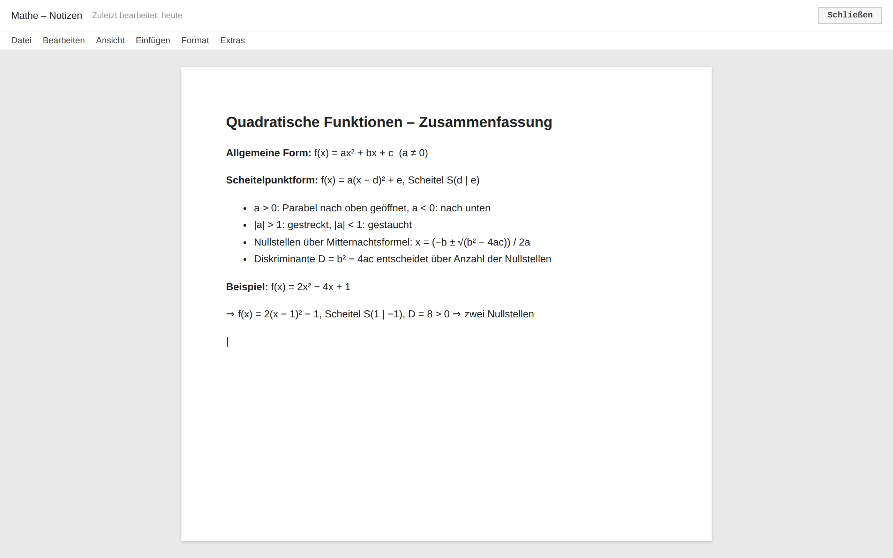

# Klassenraum.io

Ein Multiplayer-Idle-Game im Browser: **alle Spieler sitzen im selben Klassenraum.**
Sammle Hirnschmalz, kauf dir vom Bleistiftstummel bis zum Galaxienhirn hoch, klau deinen
Mitschülern per Papierflieger die Punkte — und drück Esc, wenn der Lehrer kommt.

A multiplayer browser idle game where everyone shares **one global classroom**. Pixel art,
German-first UI (English toggle in settings), built to run quietly on a school Chromebook.



| Platz aussuchen | Papierflieger werfen | Boss-Taste (Esc) |
|---|---|---|
|  |  |  |

## Features

- Idle economy with 9 school-themed generators, upgrades and prestige („Versetzung" for Goldsterne)
- One shared room: live desks for every online player, chalkboard leaderboard, class goal
- Real stealing: throw paper airplanes at other desks (5 min cooldown, capped, risky during patrol)
- Synchronized room events: Kurztest (pop quiz), Lehrer-Rundgang (patrol), Vertretungsstunde
- Chat (passed notes), emotes, offline progress up to 8 h
- Boss key: **Esc** swaps to a fake math-notes page (title + favicon included)
- Server-authoritative: all production, clicks, buys and steals are validated server-side

## Development

Requires Node >= 22.5 (uses built-in `node:sqlite`).

```bash
npm install
npm run dev:server   # game server on :8080 (ws + API)
npm run dev:client   # vite dev server on :5173, proxies /ws to :8080
```

Open http://localhost:5173 — multiple tabs/browsers join the same room
(each browser profile is one player; a second tab replaces the first connection).

## Production (all-in-one)

```bash
npm run build        # builds client + bundles server to a single file
npm start            # serves client + WebSocket on PORT (default 8080)
```

Environment: `PORT` (default `8080`), `DB_PATH` (default `./data/klassenraum.db`).
One process serves everything — put it behind any HTTPS proxy and the client
connects via `wss://` on the same origin automatically.

A `Dockerfile` is included (`docker build -t klassenraum . && docker run -p 8080:8080 -v kr-data:/data klassenraum`).

## Vercel (frontend only) + game server elsewhere

**Vercel cannot run this game's WebSocket server** — it only hosts static files.
If you deploy the client to Vercel without configuring a backend, you'll see
`WebSocket connection to 'wss://your-app.vercel.app/ws' failed`.

### 1. Deploy the game server (pick one)

Run the Node server somewhere that supports **long-lived WebSockets**:

- **Railway / Fly.io / Render / a VPS** — use the included `Dockerfile`, or `npm run build && npm start`
- Note the public **HTTPS** URL, e.g. `https://klassenraum-api.railway.app`

The WebSocket endpoint is always **`/ws`** on that host → `wss://klassenraum-api.railway.app/ws`

### 2. Point the Vercel client at that server

**Option A — Vercel env var (build time):**

In Vercel → Project → Settings → Environment Variables:

```
VITE_WS_URL = wss://klassenraum-api.railway.app/ws
```

Redeploy after setting this.

**Option B — `config.json` (no rebuild):**

Copy `packages/client/public/config.json.example` → `packages/client/public/config.json` and set:

```json
{ "wsUrl": "wss://klassenraum-api.railway.app/ws" }
```

Commit and redeploy (or edit the file in `dist/` if you manage assets manually).

### 3. Deploy the client to Vercel

`vercel.json` is included. Root directory: repo root. Build output: `packages/client/dist`.

The client tries, in order: `VITE_WS_URL` → `/config.json` → same-origin `/ws`.

## Tests

```bash
npm test               # balance math + game logic unit tests (vitest)
npm run typecheck
node scripts/bots.mjs  # simulated players against a running server
node scripts/screenshot.mjs  # browser smoke test + screenshots (playwright)
```

For lively local testing you can speed up room events:
`EVENT_MIN_GAP_MS=8000 EVENT_MAX_GAP_MS=14000 npm start`.

## Repo layout

- `packages/shared` — protocol types + balance tables/math (used by both sides)
- `packages/server` — Node WebSocket game server, SQLite persistence
- `packages/client` — Vite + canvas-2D pixel client, DOM UI, no runtime deps

See [DESIGN.md](DESIGN.md) for game design and architecture details.
